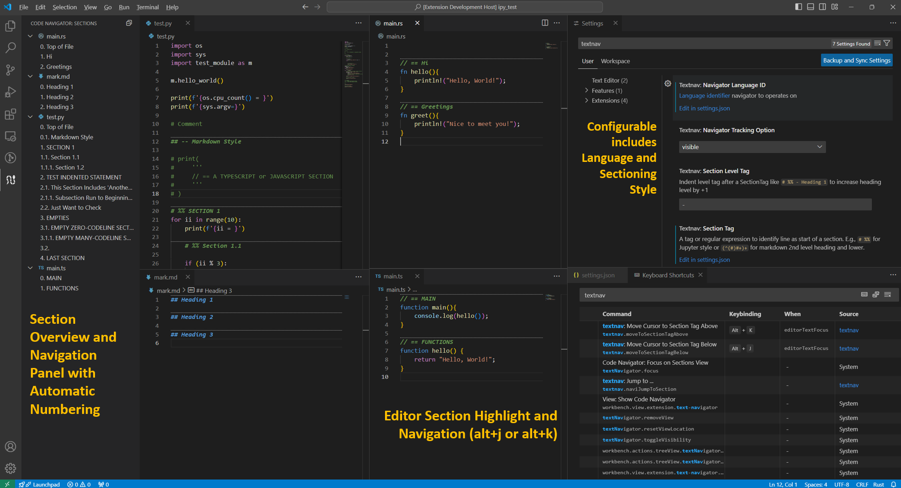

# textnav

**Purpose:** Text navigator and organization with the goal of enabling and improving code readability and maintainability.

**Motivations:** 
- Improve efficiency with navigating large code and/or text blocks
- Better visibility of implementation intent at various level(s)
- Write better code via better organization upfront
- Write better maintainable code because we all want our work to last!

**Leverages:**
- `Matlab`: cell block `%%` to organize code
- `Jupyter Notebook`: text and code are part of a story 

## Features

Key features tagged with `textnav`:

- **Settings for custom sectioning**
  - Support multiple code section tags (e.g., `# %%`, `// ==`, or regular expression)
  - Code section tag association with language identifier (e.g., `python, rust`)
- **Editor visualization of code section blocks**
  - Horizontal line divider and bolder text indicating each section starting line
- **Code section navigation**
  - A view in the primary sidebar providing section heading layout of associated files
  - Use `alt+b` to open `Code Section Navigator`
  - Click on a heading focuses the active editor to the section  
  - Section with option for lowering heading level
    - Default tabbed-in section is a lower level section
- **Code section folding**
  - Folding sections as region. See [VSCode Folding Documentation](https://code.visualstudio.com/docs/editor/codebasics#_folding).
  - Note that vscode resolves criss-cross folding by taking the higher level folding

See `Feature Contribution` tab in VSCode Extension (Ctrl + Shift + X)
panel for latest features and details.

If you find the extension useful, it would be awesome if you can leave a comment and/or a suggestion on the [project page](https://github.com/hoangKnLai/vscode-textnav/issues)!

- What feature you like and use the most?
- What other feature(s) you would like to have?

You can also give some stars and comment on the [extension marketplace](https://marketplace.visualstudio.com/items?itemName=HoangKimLai.textnav).

Enjoy and happy coding!

## Requirements

None

## Releases

### 2024.0.x

- Initial release sliced from [vscode-ipython](https://github.com/hoangKnLai/vscode-ipython)
    - Likely not compatible with `vscode-ipython` so do disable this `textnav` extension
